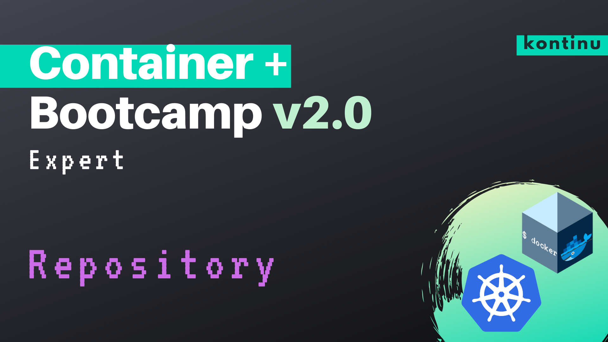

<!-- TOC -->

- [Container Expert Source](#container-expert-source)
- [Detalles](#detalles)

<!-- /TOC -->

# Container Expert Source


Todos los archivos para iniciarnos con Docker y Kubernetes en nuestro **"Container Bootcamp v2.0 - Expert"**


# Detalles

Nuestra app no sera nada llamativo ni nada complejo, por que el objetivo de este bootcamp no es ni lenguajes de programación, ni tener un app tan compleja que no nos permita avanzar; a lo largo de este bootcamp haremos refactoring a nuestra app para que aprendamos algunos detalles necesarios para hacerla mas facil la migracion a Cloud Native app.

> No es tan necesario saber programar PERO definitivamente si podría ayudar.
> Pido disculpas a aquellos developer experimentados, mi background no es desarrollo.

Tendremos 3 elecciones de lenguajes:

- [python](./src/python/app.py) [Recomendado]
- [go](./src/go/main.go)
- [nodejs](./src/nodejs/app.js)

Con estos lenguajes trabajaremos y transformaremos a manera que podamos entender los requerimientos o sugerencias que deberiamos de hacer en nuestras apps (vida real)


Cada app viene acompanado de exactamente lo mismo y se comportaran de la misma manera, a excepcion de python quien es nuestro frontend. Rutas:

- `"/"`: ruta root, mostrara un sencillo "HTML" con un mensaje importante, cada app tiene la responsabilidad de mostrar un **mensaje único.**
- `"/health"`: indica que nuestra app este saludable, nos servira en docker-compose, swarm & kubernetes.
- `"/api"`: devuelve un json con el **mensaje único.**
    ```json
    {
    "msg": "Bootcamp Experts 🤓!",
    "host": "456a45a47433"
    }
    ```


---
